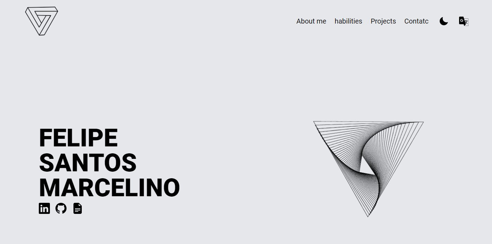

# Felipe's Portfolio

Welcome to my online portfolio, where I share my experiences and web development projects. This portfolio was built using React, TypeScript, and Tailwind CSS and is hosted on Vercel.
[Visit Portfolio](https://felipe-portfolio.vercel.app/)

## Overview

This portfolio aims to showcase my skills, projects, and experience in web development. It's a demonstration of my work and knowledge in the following areas:

- **Front-end Development**: Strong proficiency in HTML, CSS, JavaScript, React, and other modern libraries and frameworks.
- **Responsive Development**: All projects are developed with a focus on user experience across different devices and screen sizes.
- **Clean and Modern Design**: User-friendly interface and minimalist design for an enhanced browsing experience.
- **Accessibility**: Commitment to web accessibility to ensure everyone can use and navigate the site.

